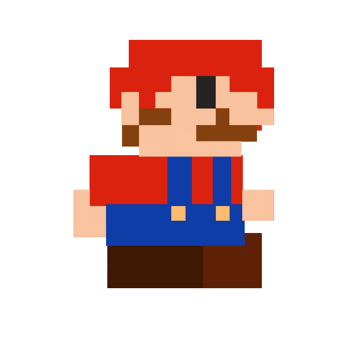

# donkey_next_level
Juego de Mario que consiste en esquivar de una manera diferente 

---

### **PRD: Prototipo *Donkey Next Level***

1. **Visión del producto**
   *Donkey Next Level* es un **prototipo de videojuego tipo plataformas** inspirado en Mario/Donkey Kong, controlado con **Arduino Esplora**, donde el jugador se desplaza inclinando el control, salta con un botón y **lanza proyectiles** al gritar. Busca experimentar con formas de interacción físicas y auditivas poco convencionales.

2. **Objetivos**

* Validar el uso del **Arduino Esplora** como controlador alternativo.
* Probar mecánicas innovadoras: movimiento por inclinación y disparo por voz.
* Servir como base para un futuro juego más completo y pulido.

3. **Público objetivo**

* Makers, estudiantes y desarrolladores curiosos.
* Jugadores jóvenes y entusiastas de experiencias experimentales (12+).

4. **Características principales**

* **Movimiento lateral**: inclinando el Esplora a los lados.
* **Salto**: botón físico.
* **Lanzamiento de objetos/proyectiles**: al detectar gritos o sonidos fuertes.
* **Niveles cortos tipo plataformas**, centrados en la jugabilidad más que en la historia.
* **Estética retro** y simple, con elementos reconocibles tipo Donkey/Mario.

5. **Requisitos técnicos**

* **Hardware**: Arduino Esplora (acelerómetro, micrófono, botones).
* **Software**: Processing o Unity para visualización; comunicación serial.
* **Entradas**: inclinación, botón, micrófono.
* **Salida**: pantalla en PC o proyector.

---

¿Quieres que lo haga **en un formato más formal (tipo documento con secciones claras)** o que lo **convierta en un diagrama visual con el nombre Donkey Next Level y las conexiones del Arduino**?
